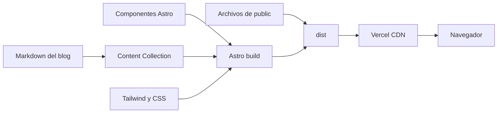
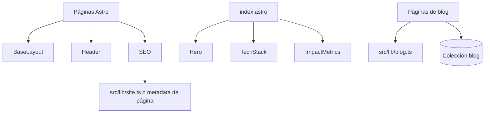

# Arquitectura

## 1. Visión general

El proyecto sigue una arquitectura de sitio estático orientada a contenido. Astro actúa como compilador y generador de rutas; Tailwind resuelve la capa de presentación; Markdown y Content Collections modelan el blog. No existe una API, base de datos ni runtime de servidor dentro de este repositorio.



## 2. Stack técnico

| Área | Tecnología | Función |
| --- | --- | --- |
| Framework | Astro `^7.0.2` | Componentes, rutas y generación estática |
| Estilos | Tailwind CSS `^3.4.19` | Clases utilitarias y responsive |
| Integración CSS | `@astrojs/tailwind` `^6.0.2` | Conecta Tailwind con Astro |
| Contenido | `astro:content`, `astro/loaders`, Zod | Carga y valida artículos Markdown |
| Lenguaje | TypeScript estricto | Tipos y aliases de imports |
| Paquetes | pnpm | Instalación reproducible mediante lockfile |
| Hosting | Vercel | Build por Git y distribución estática |

`astro.config.mjs` no define `output`, por lo que Astro utiliza el modo estático predeterminado. Tampoco existe un adaptador de servidor ni `vercel.json`.

## 3. Estructura del repositorio

```text
/
├── public/                    # Recursos copiados sin transformación
│   ├── favicon.*
│   ├── robots.txt
│   └── sitemap.xml
├── src/
│   ├── components/
│   │   ├── layout/            # BaseLayout y Header
│   │   ├── sections/          # Hero, TechStack e ImpactMetrics
│   │   └── SEO.astro          # Meta tags, Open Graph y JSON-LD
│   ├── content/blog/          # Artículos Markdown localizados
│   ├── lib/                   # Configuración del sitio y helpers
│   ├── pages/                 # Rutas estáticas y dinámicas
│   ├── scripts/               # Comportamiento typewriter
│   ├── styles/global.css      # Directivas globales de Tailwind
│   └── content.config.ts      # Colección y esquema del blog
├── docs/                      # Documentación técnica
├── astro.config.mjs           # Tailwind e i18n
├── tailwind.config.js         # Archivos escaneados por Tailwind
├── postcss.config.js          # Tailwind y Autoprefixer
├── tsconfig.json              # TypeScript estricto y aliases
└── package.json               # Scripts, engine y dependencias
```

## 4. Capas y responsabilidades

### Presentación

- `BaseLayout.astro` define el documento HTML, carga estilos globales, expone slots y aporta el enlace de salto accesible.
- `Header.astro` concentra la navegación principal.
- `sections/` encapsula los bloques de la portada.
- Las páginas ensamblan layout, SEO y contenido; no mantienen estado compartido.

### Dominio de contenido

- `src/content.config.ts` registra la colección `blog`.
- El loader `glob` lee `src/content/blog/**/*.{md,mdx}`.
- Zod exige `title`, `description`, `pubDate`, `lang`, `tags` y `slug`.
- El ID de una entrada se forma como `<lang>/<slug>`, permitiendo que las traducciones compartan slug sin colisionar.

### Utilidades

- `src/lib/site.ts` contiene dominio, nombre, metadata predeterminada e imagen social.
- `src/lib/blog.ts` valida idiomas, construye URLs, formatea fechas, ordena posts y agrupa traducciones por slug.
- Estos helpers no acceden al navegador y pueden ejecutarse durante el build.

### Cliente

La única interacción dedicada es el efecto de escritura del Hero. Las páginas del blog y el resto de las secciones se entregan como HTML estático. El formulario de contacto es demostrativo: cancela el envío y muestra un `alert`; no transmite datos.

## 5. Mapa de rutas

| Archivo | URL generada | Comportamiento |
| --- | --- | --- |
| `src/pages/index.astro` | `/` | Portada del portafolio |
| `src/pages/projects.astro` | `/projects` | Página provisional de proyectos |
| `src/pages/contact.astro` | `/contact` | Formulario de demostración |
| `src/pages/blog/index.astro` | `/blog` | Índice con entradas de ambos idiomas |
| `src/pages/blog/[slug].astro` | `/blog/:slug` | Selector de idioma y redirección en cliente |
| `src/pages/[lang]/blog/index.astro` | `/:lang/blog` | Índice filtrado por `es` o `en` |
| `src/pages/[lang]/blog/[slug].astro` | `/:lang/blog/:slug` | Artículo localizado |

Las rutas dinámicas se materializan durante el build mediante `getStaticPaths()`. Solo existen en producción las combinaciones devueltas por esa función.

## 6. Dependencias entre componentes



## 7. Imports y límites

`tsconfig.json` define aliases para evitar acoplamiento a rutas relativas: `@components`, `@layout`, `@sections`, `@ui`, `@blog`, `@content`, `@lib` y `@styles`.

Reglas de frontera:

- Las páginas controlan rutas, metadata y composición.
- Los componentes no deben conocer detalles de despliegue.
- Los helpers de `lib/` deben permanecer puros siempre que sea posible.
- El contenido editorial vive en Markdown; no debe incrustarse en lógica de rutas.
- Los recursos que requieren transformación pertenecen a `src/`; los archivos que deben conservarse intactos pertenecen a `public/`.

## 8. Decisiones y limitaciones actuales

- La generación estática reduce complejidad operativa y favorece rendimiento y caché global.
- El blog tiene i18n explícito, pero Header y páginas generales no están localizados.
- El sitemap es manual y actualmente enumera las rutas principales, no cada variante localizada ni cada artículo.
- Proyectos aún no tiene una fuente de datos estructurada.
- Contacto no tiene backend ni proveedor de formularios.
- El dominio canónico está centralizado parcialmente: las páginas nuevas deben preferir `src/lib/site.ts`.
- El efecto typewriter requiere revisión: el HTML construido apunta a `/scripts/typewriter.js`, pero el archivo está en `src/scripts/`, y la serialización inline conserva una referencia cliente a `roles`. El build no detecta este tipo de 404 o error de runtime.
- El CTA `#projects` de la portada no tiene actualmente una sección con ese ID y `/cv.pdf` no aparece en `public/`.
