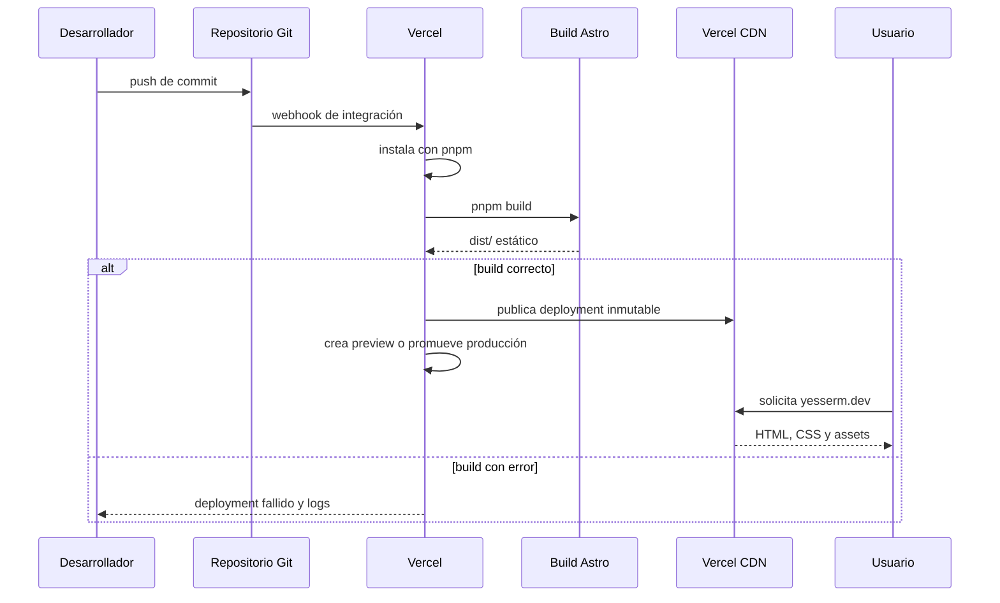

# Despliegue en Vercel

## 1. Modelo de despliegue

El repositorio produce un sitio estático. No contiene `vercel.json`, funciones serverless ni adaptador `@astrojs/vercel`. La integración Git configurada en Vercel es responsable de detectar Astro, instalar dependencias, ejecutar el build y publicar `dist/`.

Configuración esperada:

| Campo | Valor |
| --- | --- |
| Framework preset | Astro |
| Gestor de paquetes | pnpm, detectado por `pnpm-lock.yaml` |
| Node.js | Versión compatible con `>=22.12.0` |
| Build command | `pnpm build` |
| Output directory | `dist` |
| Variables requeridas | Ninguna en el código actual |

Los valores efectivos deben verificarse en Project Settings de Vercel; no están versionados en este repositorio.

## 2. Flujo push → producción



Todo push a una rama conectada puede crear un deployment. Normalmente Vercel asigna previews a ramas o pull requests y producción a la Production Branch, pero la rama concreta debe consultarse en Vercel.

## 3. Controles antes del push

```sh
pnpm install
pnpm build
```

El build debe:

- Sincronizar y validar la colección `blog`.
- Resolver todos los aliases e imports.
- Generar rutas estáticas sin colisiones.
- Crear un directorio `dist/` no vacío.

Para una inspección manual del artefacto:

```sh
pnpm preview
```

No se debe versionar `dist/`; Vercel lo recrea para cada deployment.

## 4. Producción, previews y dominios

- Preview Deployment: sirve para validar cambios de una rama o pull request con una URL aislada.
- Production Deployment: recibe el dominio público cuando el build procede de la rama de producción o se promueve manualmente.
- Dominio canónico: el código usa `https://yesserm.dev` mediante `src/lib/site.ts`.

Las previews conservan canonicals de producción de forma intencional para evitar indexar URLs temporales. `robots.txt` y `sitemap.xml` también apuntan al dominio público.

## 5. Fallos frecuentes

| Síntoma | Revisión |
| --- | --- |
| Falla la instalación | Versión de Node, pnpm y lockfile |
| Falla el esquema de contenido | Frontmatter requerido, fecha, idioma y slug |
| Ruta localizada ausente | `getStaticPaths()`, valor de `lang` y entrada Markdown |
| Canonical incorrecto | `src/lib/site.ts` y objeto `meta` de la página |
| Recurso devuelve 404 | Ubicación en `public/` o forma de importar desde `src/` |
| Cambio no aparece | Deployment asociado al commit y alias del dominio |

## 6. Recuperación

Los deployments de Vercel son inmutables. Si una publicación introduce un fallo:

1. Identificar el último deployment estable en Vercel.
2. Restaurar/promover ese deployment desde Vercel o revertir el commit en Git.
3. Confirmar el dominio y las rutas críticas.
4. Corregir la causa en una rama y validar un preview antes de volver a producción.

No se deben editar archivos directamente en `dist/` como corrección: desaparecerán en el siguiente build.

## 7. Cambios que requieren revisar este documento

- Agregar `@astrojs/vercel` o cambiar a renderizado bajo demanda.
- Añadir funciones, endpoints, acciones o middleware.
- Cambiar el comando de build o la carpeta de salida.
- Introducir variables de entorno o servicios externos.
- Cambiar dominio, rama de producción o proveedor de hosting.
- Automatizar sitemap, redirects, headers o reglas de caché.
