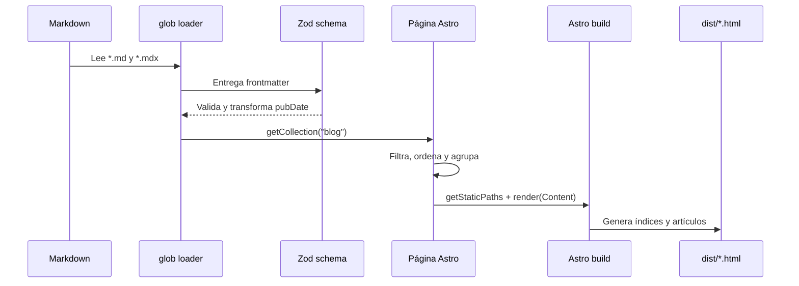
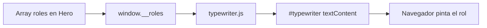

# Flujo de información

## 1. Fuentes de información

El sitio consume información desde cuatro lugares internos:

| Fuente | Contenido | Consumidor |
| --- | --- | --- |
| Frontmatter y cuerpo Markdown | Artículos y traducciones | Content Collection y rutas de blog |
| Arrays en componentes | Roles, stack y métricas | Secciones de la portada |
| `src/lib/site.ts` | Dominio y metadata compartida | Páginas y SEO |
| `public/` | Favicon, robots y sitemap | Navegador y crawlers |

No hay llamadas a APIs, base de datos, CMS ni variables de entorno en el código actual.

## 2. Flujo del contenido del blog



El ID interno se genera con `lang/slug`. Esto permite tener una entrada española y una inglesa con el mismo slug. Las traducciones se relacionan agrupándolas por `slug`, y así se crean los enlaces `hreflang`.

Si el frontmatter no cumple el esquema, el build debe fallar antes del despliegue.

## 3. Flujo de navegación del blog

```mermaid
flowchart TD
    U[Usuario abre /blog] --> L[Lista bilingüe]
    L --> P[Enlace localizado /lang/blog/slug]
    D[Usuario abre /blog/slug] --> J{JavaScript disponible}
    J -- Sí --> N{Idioma del navegador empieza con en}
    N -- Sí --> EN[/en/blog/slug]
    N -- No --> ES[/es/blog/slug]
    J -- No --> ES
```

La detección de idioma solo ocurre en la ruta puente `/blog/[slug]`; los artículos localizados ya son HTML estático independiente.

## 4. Flujo de renderizado de una página

1. La página prepara su objeto `meta` en el frontmatter.
2. `BaseLayout` crea el documento, importa Tailwind y define los slots.
3. `SEO` escribe metadata y datos estructurados en el slot `head`.
4. `Header` ocupa el slot `header`.
5. La página o sus secciones generan HTML en `main`.
6. Astro elimina lógica de servidor y guarda HTML/CSS/JS optimizados en `dist/`.
7. Vercel distribuye esos archivos desde su CDN.

Los componentes Astro no se hidratan por defecto. Por ello, la mayoría de la información llega al usuario como HTML listo para visualizar.

## 5. JavaScript del Hero

El componente `Hero.astro` define una lista de roles, la serializa en `window.__roles` y el script de escritura consume ese valor. El script actualiza el nodo `#typewriter` con temporizadores, alternando escritura, pausa y borrado.



Este comportamiento es progresivo: el contenido estructural de la página no depende del efecto, aunque el rol animado sí requiere JavaScript.

> Estado actual: este es el flujo diseñado, pero el artefacto generado aún conserva una referencia a `roles` en el navegador y solicita `/scripts/typewriter.js` sin que exista ese archivo bajo `public/scripts/`. El build finaliza porque Astro no valida la disponibilidad de esa URL en runtime. Debe corregirse y comprobarse en navegador antes de considerar operativo el efecto.

## 6. Formulario de contacto

El flujo actual termina en el navegador:

1. El usuario completa nombre, email y mensaje.
2. La validación HTML comprueba campos requeridos y formato del email.
3. `onsubmit` cancela la petición.
4. Se muestra un mensaje indicando que el formulario es de ejemplo.

No se persiste ni transmite información personal. Para convertirlo en un formulario real se deberá definir proveedor, consentimiento, protección contra spam, estados de envío/error y política de datos.

## 7. Flujo para agregar contenido

1. Crear `src/content/blog/<tema>/index.es.md`.
2. Añadir la variante `index.en.md` cuando exista traducción.
3. Usar el mismo slug en ambas variantes.
4. Ejecutar `pnpm build` para validar esquema y rutas.
5. Revisar enlaces localized y metadata.
6. Hacer commit y push; Vercel construye el nuevo contenido.

## 8. Caché y actualización

Como la salida es estática, una modificación no aparece en producción hasta completar un nuevo despliegue. Cada deployment genera un conjunto inmutable de archivos; Vercel cambia el alias del dominio al deployment aprobado. El comportamiento exacto de caché y promoción depende de la configuración del proyecto en Vercel.
